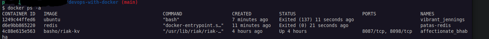
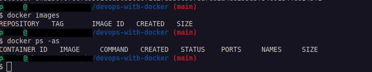

# Part 1

### 1.1


### 1.2


### 1.3
```shell
$ docker run -d -it --rm devopsdockeruh/simple-web-service:ubuntu
$ docker exec -it 6930 bash
root@6930c58f5516:/usr/src/app# tail text.log
```
*Secret message*: `Secret message is: 'You can find the source code here: https://github.com/docker-hy'`

### 1.4

``` 
$ docker run -it ubuntu sh -c 'apt update && apt install curl -y && echo "Input website:"; read website; echo "searching..."; sleep 1; curl http://$website;'
```
__alternative__
```console
$ docker run -it ubuntu sh -c 'echo "Input website:"; read website; echo "searching..."; sleep 1; curl http://$website;'
Input website:

# detach with ctrl+p ctrl+q then:
$ docker exec <container-name> sh -c 'apt update && apt install curl -y'
$ docker attach goofy_torvalds 
google.com
searching...
<HTML><HEAD><meta http-equiv="content-type" content="text/html;charset=utf-8">
<TITLE>301 Moved</TITLE></HEAD><BODY>
<H1>301 Moved</H1>
The document has moved
<A HREF="http://www.google.com/">here</A>.
</BODY></HTML>
```

### 1.5

```console
$ docker images | grep devops
devopsdockeruh/simple-web-service   ubuntu  4e3362e907d5   17 months ago   83MB
devopsdockeruh/simple-web-service   alpine  fd312adc88e0   17 months ago   15.7MB
```

### 1.6
```console 
$ docker run -it devopsdockeruh/pull_exercise
Give me the password: basics
You found the correct password. Secret message is:
"This is the secret message"
```

### 1.7
[Dockerfile](1.7/Dockerfile):
```docker
FROM devopsdockeruh/simple-web-service:alpine
CMD server
```
`$ docker run web-server:latest`

### 1.8
[Dockerfile](1.8/Dockerfile)

## Part 1.4 Improve curler with Entrypoint

## Part 1.5 Interacting with the container via volumes and ports

### Exercise 1.9
```console
docker run -v $(pwd):/usr/src/app/ devopsdockeruh/simple-web-service
```

### Exercise 1.10: Ports open
```console
# let docker map host port for me
docker run -p 127.0.0.1::8080 devopsdockeruh/simple-web-service server
# see which port was mapped
docker port [container-name]
```

## Part 1.6 Utilizing tools from the registry

### Exercise 1.11: Spring
[1.11/spring-example-project/Dockerfile](1.11/spring-example-project/Dockerfile)

### Exercise 1.12: Hello, frontend!
[1.12/example-frontend/Dockerfile](1.12/example-frontend/Dockerfile)

### Exercise 1.13: Hello, backend!
[1.13/example-backend/Dockerfile](1.13/example-backend/Dockerfile)

```console
cd 1.13/example-backend && docker build -t hello-backend .
docker run --rm -p 127.0.0.1:8080:8080 hello-backend
```

### Exercise 1.14: Environment
[1.12/example-frontend/Dockerfile](1.12/example-frontend/Dockerfile)
`docker run --rm -p 127.0.0.1:5000:5000 hello-frontend`

[1.13/example-backend/Dockerfile](1.13/example-backend/Dockerfile)
`docker run --rm -p 127.0.0.1:8080:8080 hello-backend`
